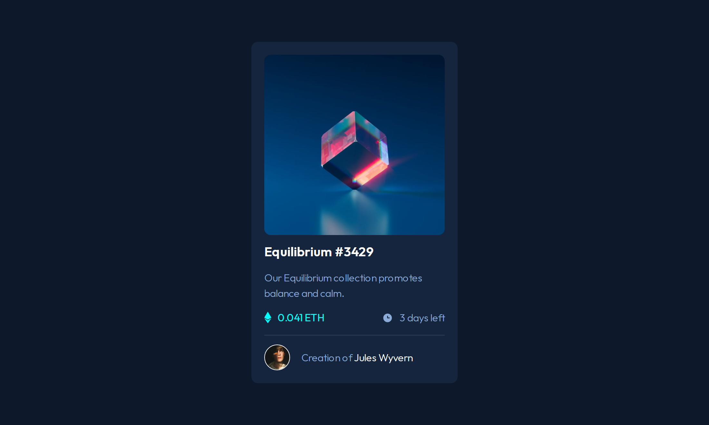

# Frontend Mentor - NFT preview card component solution

This is a solution to the [NFT preview card component challenge on Frontend Mentor](https://www.frontendmentor.io/challenges/nft-preview-card-component-SbdUL_w0U). Frontend Mentor challenges help you improve your coding skills by building realistic projects.

## Table of contents

- [Overview](#overview)
  - [The challenge](#the-challenge)
  - [Screenshot](#screenshot)
  - [Links](#links)
- [My process](#my-process)
  - [Technology Used](#technology-used)
  - [Useful resources](#useful-resources)
- [Author](#author)

## Overview

### The challenge

Users should be able to:

- View the optimal layout depending on their device's screen size
- See hover states for interactive elements

### Screenshot

### Links

- **Solution:** [frontendmentor.io/solutions/nft-preview-card-component-scss-zvzmRM1uEk](https://www.frontendmentor.io/solutions/nft-preview-card-component-scss-zvzmRM1uEk)
- **Live Site:** [fem-nft-card.pages.dev](https://fem-nft-card.pages.dev/)

## My process

### Technology Used

- **Semantic HTML5 markup:** To provide a clear and meaningful structure to the content.
- **CSS custom properties:** To efficiently manage and reuse style values throughout the project.
- **Flexbox:** To create flexible and responsive layouts.
- **SASS:** To write CSS more efficiently with nested rules, variables, and mixins.
- **BEM (Block Element Modifier):** To create modular, reusable, and maintainable CSS code.
- **Mobile-first workflow:** To ensure a better user experience on smaller screens and devices.

### Useful resources

- [SASS documentation](https://sass-lang.com/documentation): The official SASS documentation serve as a valuable reference for understanding the syntax, features, and capabilities of SASS.

## Author

This project was created by **Fortune Iyoha**. If you want to connect with me or view more of my projects, you can visit my [Frontend Mentor profile](https://www.frontendmentor.io/profile/fortune-i-o) or follow me on [Twitter](https://twitter.com/fortuneiyoha) for updates and web development discussions.
